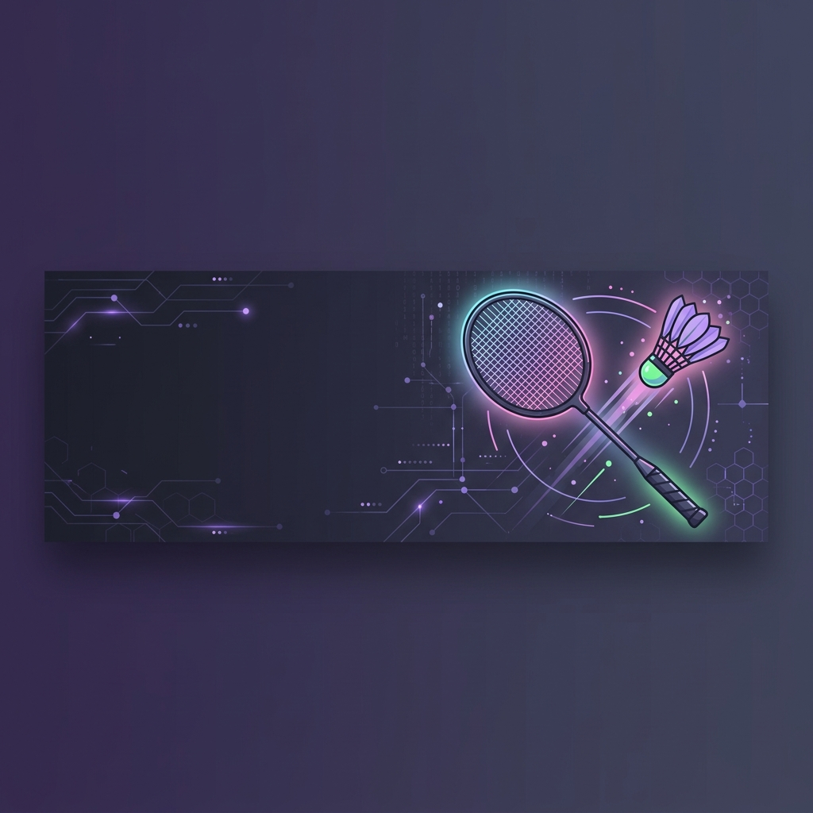

<!-- Banner -->
<p align="center">
  
</p>

<!-- Animated Greeting -->
<h1 align="center">
  
</h1>

<!-- Profile Views & Social Badges -->
<p align="center">
  <a href="https://github.com/MinhCr007">
    
  </a>
  <a href="https://github.com/MinhCr007?tab=followers">
    
  </a>
  <a href="https://github.com/MinhCr007?tab=repositories&sort=stargazers">
    
  </a>
</p>

---

## 🏸 About Me

```yaml
name: Minh
located_in: Vietnam 🇻🇳
hobbies: ["Badminton 🏸", "Sports ⚽", "Coding 💻"]
fun_fact: "I smash bugs in code as hard as I smash shuttlecocks on the court! 🏸💥"
currently_learning: "Always exploring new technologies"
motto: "Code hard, play harder!"
```


- 🏸 **Cầu lông** là đam mê — vừa code, vừa đánh cầu!
- ⚡ Yêu thích thể thao & lối sống năng động
- 🔭 Đang phát triển các dự án thú vị trên GitHub
- 🌱 Luôn học hỏi công nghệ mới mỗi ngày
- 💬 Hãy liên hệ nếu bạn muốn cùng code hoặc... đánh cầu lông!
- 🎯 Mục tiêu: Contribute nhiều hơn cho open source

<br clear="both"/>

---

## 📊 GitHub Stats

<p align="center">
  <a href="https://github.com/MinhCr007">
    
    
  </a>
</p>

<!-- GitHub Streak Stats -->
<p align="center">
  <a href="https://github.com/MinhCr007">
    
  </a>
</p>

<!-- Activity Graph -->
<p align="center">
  <a href="https://github.com/MinhCr007">
    
  </a>
</p>

---

## 🛠️ Tech Stack

<p align="center">
  
  
  
  
  
  
  
  
  
  
</p>

---

## 🏆 GitHub Trophies

<p align="center">
  <a href="https://github.com/MinhCr007">
    
  </a>
</p>

---

## 🏸 Fun Zone

<table align="center">
  <tr>
    <td align="center" width="50%">

### 💭 Random Dev Quote
<br>

[](https://github.com/piyushsuthar/github-readme-quotes)

</td>
    <td align="center" width="50%">

### 🏸 Badminton Facts
<br>

> 🏸 Tốc độ cầu lông nhanh nhất: **493 km/h**!
>
> 🎯 Phản xạ nhanh, code cũng nhanh!
>
> 💪 "Clear, smash, drop — just like debug, fix, deploy!"

</td>
  </tr>
</table>

---

<p align="center">
  
</p>

<p align="center">
  <b>⭐ Star my repos if you find them interesting! ⭐</b>
  <br><br>
  <i>"Code like you smash — with full power and precision! 🏸"</i>
</p>
